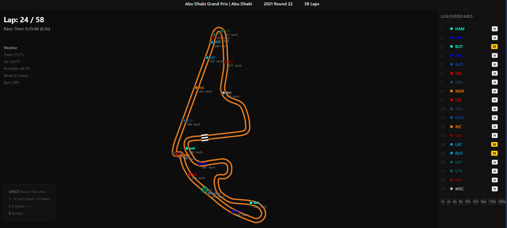

# 🏎️ F1 Race Replay

A web-based Formula 1 race replay tool built with **FastAPI** and **HTML Canvas**. Watch real F1 races and qualifying sessions replay in your browser with live driver positions, leaderboard, DRS zones, weather data, and more — all powered by real telemetry from the FastF1 API.


---

## 📸 Preview



> Abu Dhabi Grand Prix 2021 — Lap 24/58 

The replay shows the real Yas Marina Circuit shape drawn from FastF1 GPS telemetry, with all 20 drivers moving in real time at their actual race positions.

---

## ✨ Features

- **Real Race Replay** — Watch any F1 race or qualifying session from 2018 to present
- **Live Leaderboard** — Live positions update every frame with team colors and tyre compounds
- **Real Track Layout** — Circuit drawn from actual FastF1 GPS telemetry coordinates
- **DRS Zones** — Green highlights show where DRS is active
- **Driver Labels** — Driver codes and live speed shown next to each dot
- **Safety Car / VSC** — Animated banner when safety car or VSC is deployed
- **Weather Panel** — Live track temp, air temp, humidity, wind speed, rain status
- **Playback Controls** — Pause, rewind, fast forward, speed up to 256x

---

## 🏗️ Architecture

```
FastF1 API  ──►  f1_data.py  ──►  cache/*.pkl
                                        │
                                    api.py (FastAPI)
                                   /          \
                          REST endpoints    WebSocket
                               │                │
                          index.html       replay.js
                        (race picker)    (canvas renderer)
```

**Data flow:**
1. `fastf1` downloads real telemetry from the official F1 data feed
2. `f1_data.py` processes 20 drivers in parallel, resamples to 25fps frames
3. `api.py` serves metadata over REST and streams frames over WebSocket
4. `replay.js` draws the track and animates drivers on an HTML Canvas

---

## 🗂️ Project Structure

```
f1-replay/
├── f1_data.py          # FastF1 data pipeline — loads, processes, caches
├── api.py              # FastAPI server — REST endpoints + WebSocket streamer
├── requirements.txt    # Python dependencies
└── frontend/
    ├── index.html      # Race picker page (year → round → session)
    ├── replay.html     # Main replay viewer layout
    └── replay.js       # Canvas renderer + WebSocket client
```

---

## ⚙️ Tech Stack

| Layer    | Technology         | Purpose                          |
|----------|--------------------|----------------------------------|
| Data     | FastF1             | Real F1 telemetry data           |
| Data     | NumPy / Pandas     | Telemetry processing & resampling|
| Backend  | FastAPI            | REST API + WebSocket server      |
| Backend  | Uvicorn            | ASGI server                      |
| Backend  | Pickle             | Frame caching                    |
| Frontend | HTML Canvas        | Track and driver rendering       |
| Frontend | Vanilla JavaScript | WebSocket client + animation loop|

---

## 🚀 Getting Started

### Prerequisites

- Python 3.11+
- pip

### Installation

**1. Clone the repository**
```bash
https://github.com/sashank46/f1-replay.git
cd f1-replay
```

**2. Create and activate a virtual environment**
```bash
# Windows
python -m venv venv
venv\Scripts\activate

# Mac / Linux
python3 -m venv venv
source venv/bin/activate
```

**3. Install dependencies**
```bash
pip install -r requirements.txt
```

**4. Run the server**
```bash
uvicorn api:app --reload
```

**5. Open in browser**
```
http://localhost:8000
```

---

## 🎮 Usage

1. Open `http://localhost:8000`
2. Select a **year** (2018–2024)
3. Select a **race weekend** from the dropdown
4. Select a **session** — Race, Qualifying, or Sprint
5. Click **LOAD & WATCH**

> ⏳ **First load takes 5–15 minutes** — FastF1 downloads and processes telemetry for all 20 drivers. After that it's cached and loads in under 5 seconds.

---

## ⌨️ Controls

| Key | Action |
|-----|--------|
| `SPACE` | Pause / Resume |
| `← →` | Jump back / forward 500 frames |
| `↑ ↓` | Speed up / slow down |
| `R` | Restart from beginning |

Speed buttons in the leaderboard panel: `1x` `2x` `4x` `8x` `16x` `32x` `64x` `128x` `256x`

Click the **progress bar** at the bottom to seek to any point in the race.

---

## 📦 Requirements

```
fastf1
fastapi
uvicorn[standard]
numpy
pandas
```

---

## 🗃️ Caching

Two cache folders are created automatically:

- `.fastf1-cache/` — Raw F1 data downloaded from the FastF1 API (~50–200MB per race weekend)
- `cache/` — Processed frame data ready for replay (~20–50MB per session)

To force a refresh of processed data, delete the `cache/` folder:
```bash
# Windows
Remove-Item -Recurse -Force cache

# Mac / Linux
rm -rf cache
```

---

## ⚠️ Disclaimer

No copyright infringement intended. Formula 1 and related trademarks are the property of Formula One World Championship Limited. All data is sourced from the publicly available FastF1 API and is used for educational and non-commercial purposes only.

---

## 📝 License

This project is licensed under the MIT License.

---

## 🙏 Acknowledgements

- [FastF1](https://github.com/theOehrly/Fast-F1) — The incredible Python library that makes real F1 telemetry data accessible
